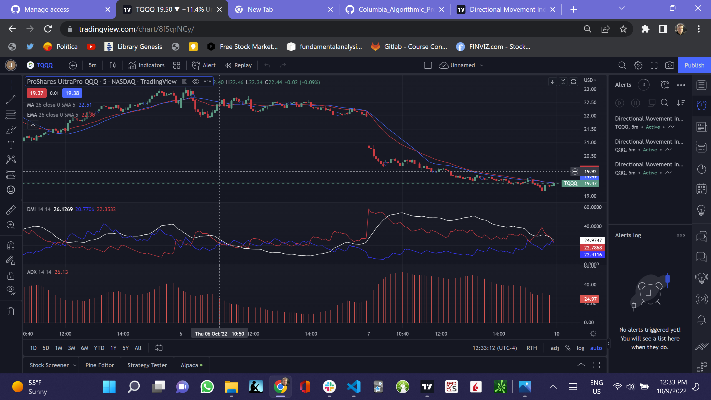
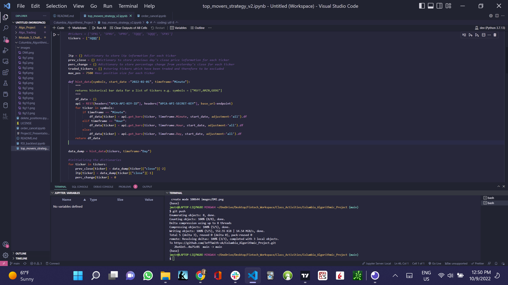

# Algorithmic_Trading_Project

The 2nd Group Project on Sentimental Algorithmic Trading

## Introduction

Jeff Smith is the leader of the project and he made excellent gains made on a paper trading account held with Alpaca Markets Brokerage. Alpaca provides access to US stock markets, historical data, and fundamental data through its API. He learned about Alpaca from this Financial Technology Computer Programming Certificate Program offered by Columbia University in the City of New York and began to trade with Alpaca through a course offered by Mayank Rasu, Vice President, Quantitative Analytics, at Barclays Investment Bank.

He began this venture by coding the trading files and selecting the most profitable securities. He quicky began to realize that by following the market and the news both live on the televison and on the financial websites, he could quickly enter the market and earn gains by buying or shorting the securities and exit the positions quickly. He believes that the market is made up of rallies and crashes, based on the political, economic and climatic events that happen around the world.

Russell Moore undertook to train, along with Sheng Gao, a sentimental machine learning algorithm to interpret the headlines as either positive or negative for the Nasdaq, and then we could theoretically trade based on the machine learning signals.

Mike Cutno began to envision the use of technical indicators to help us exit the trade when it was most appropriate, either by trading or by giving us an alert that the technical indicators have been reached to potentially exit the trade.

Finally, and equally important, Sheng Gao is our presentation leader. He organized and created our presentation and told us what to do. He is an essential part of our team.

In order to profitably trade, technical indicators need to be used to confirm what you believe is going to happen with the market and alert to exit your positions when the indicators do not agree. One of the technical indicators Jeff strongly believes for this strategy is the DMI indicator.

The Directional Movement Index (DMI) is actually a collection of three separate indicators combined into one. Directional Movement consists of the Average Directional Index (ADX), Plus Directional Indicator (+DI) and Minus Directional Indicator (-DI). ADX's purpose is to define whether or not there is a trend present. It does not take direction into account at all. The other two indicators (+DI and -DI) are used to complement the ADX. They serve the purpose of determining trend direction. By combining all three, a technical analyst has a way of determining and measuring a trend's strength as well as its direction. (tradingview.com)

##  </br>

---

## Installation Guide

Git clone the repo and run it, pursuant to the following clone address

git clone https://github.com/JeffSmith-ok/Columbia_Algorithmic_Project

cd Columbia_Algorithmic_Project

Create a .env file in the project folder and place your api key and api secret key as follows:

ALPACA_API_KEY = "INSERT HERE"

ALPACA_SECRET_KEY = "INSERT HERE"

---

Enter into your virtual environment and activate it and pip install the libraries and dependencies

---

## Usage

The following images show the top_movers_strategy run in the VS Code.

##  </br>

---

## Contributors

This is the second group project.

Our contact information is:

Name: Jeffrey M. Smith </br>
Linkedin: https://www.linkedin.com/in/jeffsmith77/ </br>
Personal email: jsmith@lexsmith.finance </br>

Name: Russell Moore </br>
Linkedin: https://www.linkedin.com/in/russell-david-moore/ </br>
Personal email: rdm5181@gmail.com </br>

Name: Mike Cutno </br>
Linkedin: https://www.linkedin.com/in/mikefree27/ </br>
Personal email: mikecutno@gmail.com </br>

Name: Sheng Gao </br>
Linkedin: https://www.linkedin.com/in/sheng-gao-11337b216/ </br>
Personal email: sheng_gao@outlook.com </br>

---

## License

MIT License

Copyright (c) 2022 Jeffrey M. Smith

Permission is hereby granted, free of charge, to any person obtaining a copy of this software and associated documentation files (the "Software"), to deal in the Software without restriction, including without limitation the rights to use, copy, modify, merge, publish, distribute, sublicense, and/or sell
copies of the Software, and to permit persons to whom the Software is furnished to do so, subject to the following conditions:

The above copyright notice and this permission notice shall be included in all copies or substantial portions of the Software.

THE SOFTWARE IS PROVIDED "AS IS", WITHOUT WARRANTY OF ANY KIND, EXPRESS OR IMPLIED, INCLUDING BUT NOT LIMITED TO THE WARRANTIES OF MERCHANTABILITY, FITNESS FOR A PARTICULAR PURPOSE AND NONINFRINGEMENT. IN NO EVENT SHALL THE AUTHORS OR COPYRIGHT HOLDERS BE LIABLE FOR ANY CLAIM, DAMAGES OR OTHER LIABILITY, WHETHER IN AN ACTION OF CONTRACT, TORT OR OTHERWISE, ARISING FROM, OUT OF OR IN CONNECTION WITH THE SOFTWARE OR THE USE OR OTHER DEALINGS IN THE
SOFTWARE.

```

```
